<!--
**PiSaucer/PiSaucer** is a ✨ _special_ ✨ repository because its `README.md` (this file) appears on your GitHub profile.

Here are some ideas to get you started:

- 🔭 I’m currently working on ...
- 🌱 I’m currently learning ...
- 👯 I’m looking to collaborate on ...
- 🤔 I’m looking for help with ...
- 💬 Ask me about ...
- 📫 How to reach me: ...
- 😄 Pronouns: ...
- ⚡ Fun fact: ...

https://metrics.lecoq.io/PiSaucer?base.activity=0&base.community=0&pagespeed=1&languages=1&isocalendar=1&pagespeed.detailed=true&isocalendar.duration=half-year
-->

- 🔭 I’m currently working on [Mountain Top's Guide](https://newcaledoniadevteam.github.io/MountainsGuide/) and [VanillaTweaksBedrock](https://vanillatweaksbedrock.web.app)
- 😄 Pronouns: he/him
- 🌱 I’m currently learning everything

